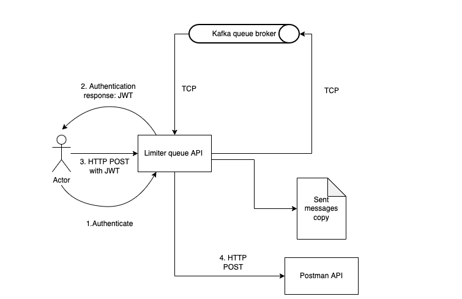

## **Rate Limit And Queue API Example**

#### Architecture Flow:

The application basically consists of an API that receives POST requests and tries resending them to a third party postman API, but limiting them in the client side (This API), so that some of them are able to reach the destination postman API, depending on the configured environment variables. Th remaining requests are enqueued in a Kafka queue, and polled again when the API is ready to receive more requests. These polled requests will be sent in a rate that will be not greater than the capacity of the API (rate-limiter limit), so that this last one won't be overloaded. The sequence will continue until all the pending enqueued requests are equal to 0.

In order to track the processing of the API, for this use case there is a file created, in which the application will read the sent requests, so that one can track the requests sent to the postman API as well as the state of the service (enqueued requests and sent ones)

#### How to use it:

1. navigate to the root directory of the application.

2. run `docker compose up -d`and wait until the images are loaded successfully.

3. run the spring boot application.

4. run the following command `curl --location --request POST 'http://localhost:8080/v0/accept'`to send the POST request to the running API

5. Note: The application in the LimiterQueueExampleApplication, lines 42 to 44 is running a demonstration of the functionality of the application by mimicking the sending of 30 requests to the controller, and seeing how the API behaves when a real request is sent. To see the results of that, navigate to `<root directory of this application>/src/main/resources/test.txt`.
   
   

Thank you!
